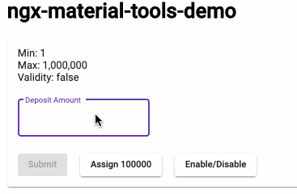
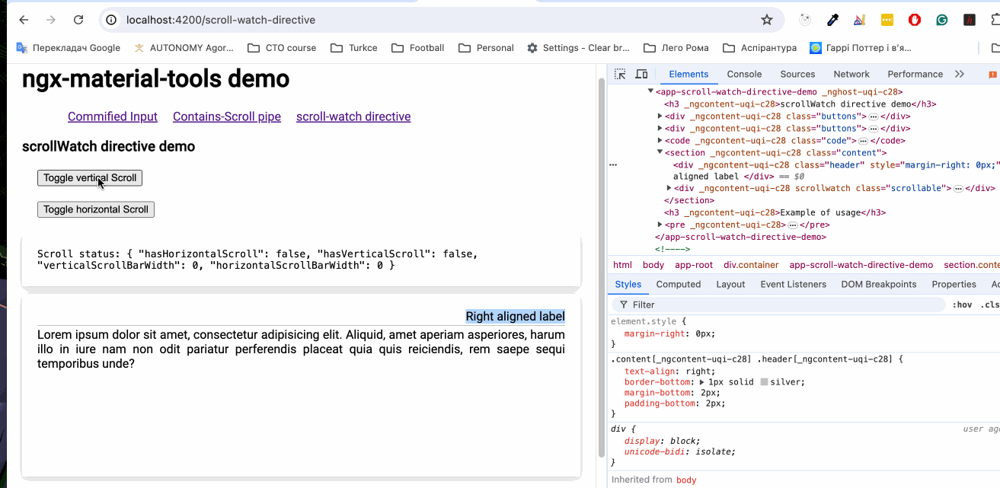

# NgxMaterialToolsDemo

Updated to Angular 14

#### This is a set of custom directives lib for Angular Materials.

For now it contains only *matInputCommified* directive to be used with standard material matInput.

## How to use

#### Install package
```
npm i ngx-material-tools
```

#### Import module

```
...
import {NgxMaterialToolsModule} from 'ngx-material-tools';

@NgModule({
...
  imports: [
...
    NgxMaterialToolsModule
  ],
...
})
export class AppModule { }
```
<br/>

### matInputCommified directive
#### Use matInputCommified directive together with matInput in Angular Reactive Forms 
```
  <form [formGroup]="myForm" style="margin-top: 20px">
    <mat-form-field appearance="outline">
      <mat-label>Deposit Amount</mat-label>
      <input matInput
             matInputCommified
             formControlName="deposit"
             type="text"/>
    </mat-form-field>
  </form>
>
```

#### matInputCommified demo


<br/>

### scrollWatch directive
It allows to monitor if scroll appear on specific element (and change other elements layout respectively if needed).
In particular: sometimes if scroll appears some elements alignment may need change (for examples labels above the container may be shifted to compensate scrollBar width)

```angular2html
<code class="code">
  Scroll status: {{scrollable.data | json}}
</code>
<section class="content" >
  <div class="header" [style.margin-right.px]="scrollable?.data?.verticalScrollBarWidth">
    Right aligned label
  </div>
  <div class="scrollable" scrollWatch #scrollable="scrollDetails" >
    <div class="some-long-text" *ngIf="showHideLongContent">
      Lorem ipsum dolor sit amet, consectetur adipisicing elit. Aliquid, amet aperiam asperiores, harum illo in iure nam non odit pariatur perferendis placeat quia quis reiciendis, rem saepe sequi temporibus unde?
      Lorem ipsum dolor sit amet, consectetur adipisicing elit. Aliquid, amet aperiam asperiores, harum illo in iure nam non odit pariatur perferendis placeat quia quis reiciendis, rem saepe sequi temporibus unde?
      Lorem ipsum dolor sit amet, consectetur adipisicing elit. Aliquid, amet aperiam asperiores, harum illo in iure nam non odit pariatur perferendis placeat quia quis reiciendis, rem saepe sequi temporibus unde?
      Lorem ipsum dolor sit amet, consectetur adipisicing elit. Aliquid, amet aperiam asperiores, harum illo in iure nam non odit pariatur perferendis placeat quia quis reiciendis, rem saepe sequi temporibus unde?
      Lorem ipsum dolor sit amet, consectetur adipisicing elit. Aliquid, amet aperiam asperiores, harum illo in iure nam non odit pariatur perferendis placeat quia quis reiciendis, rem saepe sequi temporibus unde?
    </div>
  </div>
</section>
```

1. Put attribute directive _scrollWatch_ directive on specific html element
2. assign directive instance axported as _scrollDetails_ to any ref variable (#scrollable="scrollDetails")
3. Use that variable in scope of template (for example to correct margin of element above)

#### scrollWatch directive demo


<br/>

### containsScroll pipe
You can also control specific container scrollBar visibility to a _containsScroll_ pipe.
It returns Observable which emit scrollBar data, so use  Angular _async_ to read them.

But I recommend to use _scrollWatch_ directive since each time you use pipe in template - new instance of MutationObserver is created.

```angular2html
<section class="content" >

  Scroll status: {{(scrollable | containsScroll | async) | json}}

  <div class="header" [style.margin-right.px]="(scrollable | containsScroll | async)?.verticalScrollBarWidth || 0">
    Right aligned label
  </div>
  <div class="scrollable" #scrollable >
    <div class="some-long-text" *ngIf="showLongContent">
      Lorem ipsum dolor sit amet, consectetur adipisicing elit. Aliquid, amet aperiam asperiores, harum illo in iure nam non odit pariatur perferendis placeat quia quis reiciendis, rem saepe sequi temporibus unde?
      Lorem ipsum dolor sit amet, consectetur adipisicing elit. Aliquid, amet aperiam asperiores, harum illo in iure nam non odit pariatur perferendis placeat quia quis reiciendis, rem saepe sequi temporibus unde?
      Lorem ipsum dolor sit amet, consectetur adipisicing elit. Aliquid, amet aperiam asperiores, harum illo in iure nam non odit pariatur perferendis placeat quia quis reiciendis, rem saepe sequi temporibus unde?
      Lorem ipsum dolor sit amet, consectetur adipisicing elit. Aliquid, amet aperiam asperiores, harum illo in iure nam non odit pariatur perferendis placeat quia quis reiciendis, rem saepe sequi temporibus unde?
      Lorem ipsum dolor sit amet, consectetur adipisicing elit. Aliquid, amet aperiam asperiores, harum illo in iure nam non odit pariatur perferendis placeat quia quis reiciendis, rem saepe sequi temporibus unde?
    </div>
  </div>
</section>
```
Check demo app for details

### Start demo project

Clone this repo and do npm install

```
npm install

ng serve
```
Go to http://localhost:4200


Did you Like this lib? Follow me on [Twitter](https://twitter.com/El_Extremal) for more Angular and RxJS staff!

Need a mentorship for Angular and RxJS? Find me on [codementor.io](https://www.codementor.io/alexanderposhtaruk)

Take a look at my video-course on Udemy/PacktPub:
* ["Hands-on RxJS for Web Development"](https://www.packtpub.com/web-development/hands-rxjs-web-development-video)
* ["RxJS unit testing for Angular apps"](https://www.udemy.com/course/rxjs-unit-testing-in-angular-application-the-whole-picture/)

Check my Youtube video-blog ["Angular can waste your time!"](https://www.youtube.com/playlist?list=PLNadw4d8-KMVSOffiYBuOlzvF38sO9pdu)


*This project was generated with [Angular CLI](https://github.com/angular/angular-cli) version 8.3.14.


